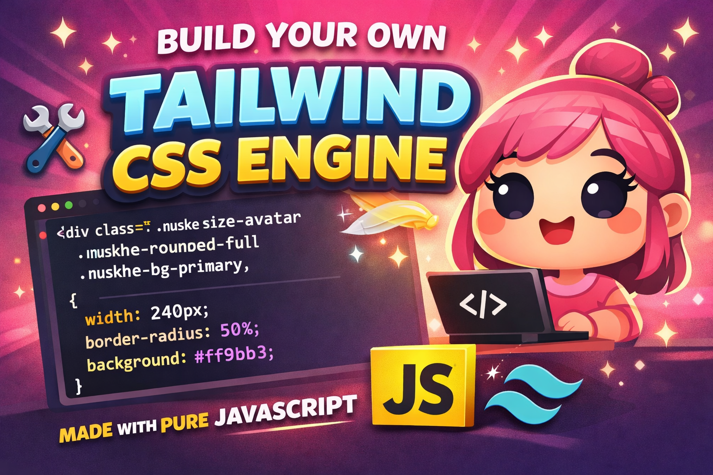

# 💅 Buty Parler CSS Engine (Nuskhe JS Framework)



A lightweight utility-first CSS engine built using pure JavaScript — no CSS file required 🚀

---

## 🚀 Live Demo

👉 https://buty-parler.vercel.app/

---

## 📂 GitHub Repository

👉 https://github.com/shubhamkm5382/buty-parler 

---

## 📌 About the Project

This project is a custom-built **utility-first CSS engine** where styles are generated dynamically using JavaScript.

Instead of writing traditional CSS, I created my own system using classes like:

- `nuskhe-bg-primary`
- `nuskhe-size-avatar`
- `nuskhe-rounded-full`

The engine reads these classes, generates CSS, and applies styles automatically.

---

## 💡 Concept (Beauty Parlour Analogy 💅)

- 👩 HTML → Ladki (structure)
- 💄 Tokens → Beauty Products (design system)
- 👩‍🎨 JavaScript → Makeup Artist (logic)
- 🎨 CSS → Makeup
- ✨ Final UI → Sundar Website

---

## ⚙️ How It Works

1. DOM scan hota hai (all elements)
2. `nuskhe-*` classes extract hoti hain
3. Class names parse kiye jate hain
4. Tokens se values li jati hain
5. CSS dynamically generate hota hai
6. Browser me style apply hota hai

---

## 🎯 Example Usage

### HTML

```html
<div class="nuskhe-bg-primary nuskhe-size-avatar nuskhe-rounded-full"></div>
```

---

## 📁 Project Structure

buty-parler/
│
├── vishkanya.html # HTML (Ladki - UI structure)
├── butay-ke-nuskhe.js # Tokens (colors, sizes, spacing)
├── makeup-artist.js # CSS Generator (Makeup artist)
├── makeover-chalu-kar.js # Engine (scan + apply CSS)
├── thumbnail.png # Project thumbnail
└── README.md # Documentation
